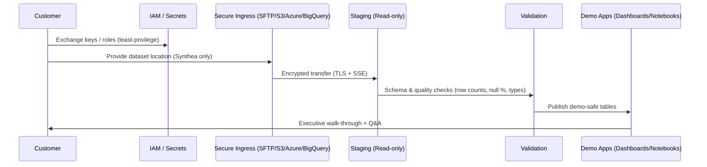
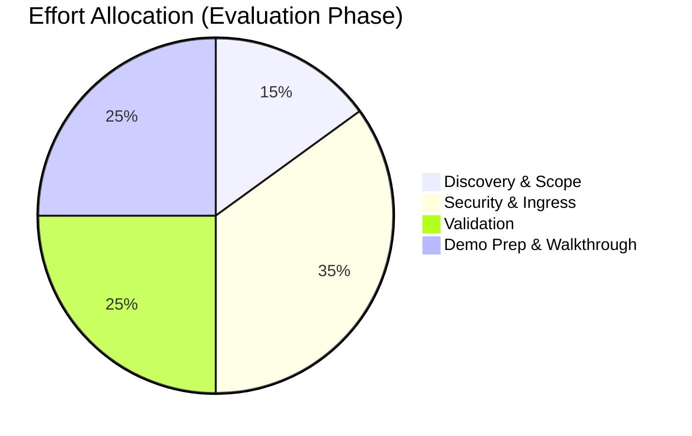

# QMTRY-Kickoff-and-Secure-Access
30-min discovery → BAA → secure ingress (SFTP/S3/Azure/BigQuery) with Synthea demo and audit-ready evidence.
Here’s a polished, copy-ready **README.md** for a GitHub repo that matches your “Kickoff & Secure Access” box. It’s executive-friendly, compliance-forward, and packed with charts & flowcharts that render on GitHub via Mermaid.

---

# QMTRY — Kickoff & Secure Access

> **30-minute discovery, scope, and BAA.** We agree on a secure transfer (**SFTP / S3 / Azure Blob / BigQuery**) and use **Synthea** synthetic data for demos — **no PHI in examples**.

[🌐 See our onboarding](https://qmtry.ai/compliance/) • Contact: [contracts@qmtry.com](mailto:contracts@qmtry.com)

---

## Why this repo exists

Healthcare leaders want a **safe, fast path** to evaluate QMTRY. This repo documents that path: how we meet, sign the BAA, stand up **secure data ingress**, validate with **synthetic Synthea** data, and show an **audit-ready** demo without touching PHI.

---

## Table of Contents

* [Executive Summary](#executive-summary)
* [Onboarding Flow (30-min → demo)](#onboarding-flow-30-min--demo)
* [Security & Compliance Controls](#security--compliance-controls)
* [Architecture & Data Flow](#architecture--data-flow)
* [Timeline (Gantt)](#timeline-gantt)
* [Effort Breakdown (Pie)](#effort-breakdown-pie)
* [What to Bring to the Call](#what-to-bring-to-the-call)
* [Secure Transfer Recipes](#secure-transfer-recipes)
* [Evidence Bundle (What you receive)](#evidence-bundle-what-you-receive)
* [Appendix: Sample Data Contract](#appendix-sample-data-contract)

---

## Executive Summary

* **Goal:** in one short session, align on scope and security, execute a **BAA**, and pick your **secure ingress** option.
* **Demo Safety:** we use **Synthea** data end-to-end for examples; **no PHI** enters our systems during evaluation.
* **Outcome:** a reproducible, evidence-backed demo and a ready path to production if you choose to proceed.

---

## Onboarding Flow (30-min → demo)

```mermaid
flowchart TD
    A[Discovery Call (30 min)] --> B[Scope & Success Criteria]
    B --> C[BAA Execution]
    C --> D{Choose Secure Ingress}
    D --> D1[SFTP]
    D --> D2[S3 Bucket (AWS)]
    D --> D3[Azure Blob]
    D --> D4[BigQuery External Table]
    D1 --> E[Ingress Policy + Keys/Role]
    D2 --> E
    D3 --> E
    D4 --> E
    E --> F[Synthea Demo Dataset (No PHI)]
    F --> G[Validation Checks (Schema, Row Counts, Nulls)]
    G --> H[Demo Notebook & Dashboard]
    H --> I[Evidence Bundle (audit-ready)]
```

---

## Security & Compliance Controls

* **BAA** before any non-public data.
* **No PHI for demos** — Synthea synthetic data only.
* **Encryption in transit & at rest** (TLS, server-side encryption / SSE-S3 / SSE-KMS / Azure SSE).
* **Least-privilege access** (scoped IAM roles, time-boxed credentials).
* **Data minimization & retention**: demo artifacts kept only as long as necessary.
* **Audit trail**: logs for ingress, validation, and access.

---

## Architecture & Data Flow



---

## Timeline (Gantt)


---

## Effort Breakdown (Pie)



---

## What to Bring to the Call

* Your **goal** (e.g., Stars, HEDIS, UM/RCM, population health).
* **Preferred cloud** (AWS/Azure/GCP) and **ingress option**.
* A **technical contact** for IAM/keys.
* Any **reporting deadlines** and success criteria.

---

## Secure Transfer Recipes

> Pick the path that matches your environment. All examples below assume **synthetic Synthea** data.

### 1) SFTP (recommended for simple pilots)

```bash
# Upload (client-side)
sftp -i /path/to/key demo_ingress@ingress.qmtry.ai <<'EOF'
put ./synthea/*.csv /incoming/synthea/
bye
EOF
```

### 2) AWS S3 (customer-owned bucket, read-only role for QMTRY)

```bash
# Example: create a bucket and upload (customer side)
aws s3 mb s3://qmtry-demo-synthea --region us-east-1
aws s3 sync ./synthea s3://qmtry-demo-synthea/synthea/

# Bucket policy (grant read to QMTRY's external role; sample only)
# (Replace ACCOUNT_ID/ROLE_ARN with the exact IDs we exchange under BAA.)
```

### 3) Azure Blob Storage

```bash
# Upload with az CLI
az storage blob upload-batch \
  --account-name <yourAccount> \
  --destination 'qmtry-demo/synthea' \
  --source ./synthea
```

### 4) BigQuery External Table (point to data without copying)

```sql
-- Customer creates an external table from GCS with synthetic CSVs
CREATE EXTERNAL TABLE `demo.synthea_patients`
WITH CONNECTION `us.gcs.my_conn`
OPTIONS (
  format = 'CSV',
  uris = ['gs://qmtry-demo/synthea/patients/*.csv'],
  skip_leading_rows = 1
);
```

> **Note:** We’ll align exact IAM policies and ARNs in the BAA/ingress worksheet.

---

## Evidence Bundle (What you receive)

* **Ingress checklist** (who/what/when, key custody, TTL).
* **Validation report** (schema, row counts, null %, type mismatches).
* **Run log** (timestamped).
* **Demo workbook** (queries + visuals).
* **Security summary** (controls applied, retention).

All items are **exportable** for auditors.

---

## Appendix: Sample Data Contract

| Field            | Type   | Required | Notes                            |
| ---------------- | ------ | -------: | -------------------------------- |
| `patient_id`     | STRING |        ✅ | Surrogate ID (synthetic)         |
| `dob`            | DATE   |        ✅ | No real DOB in demos (Synthea)   |
| `gender`         | STRING |        ✅ | Coded per Synthea                |
| `encounter_date` | DATE   |        ✅ |                                  |
| `code_system`    | STRING |        ✅ | e.g., ICD-10, RxNorm (synthetic) |
| `code`           | STRING |        ✅ |                                  |
| `value`          | STRING |        ✅ | Observation or metric            |

> **PHI Policy (Demo):** Synthea only. No direct or indirect identifiers.

---

## FAQ (Exec-friendly)

* **Can we use real PHI in the pilot?** Not for the initial demo. We begin with Synthea. PHI only after BAA + security sign-off.
* **How long until a demo?** Typically 2–4 business days after BAA and ingress setup.
* **What do we keep?** Only the minimum. Demo data can be deleted immediately on request.

---

## License

MIT (for this documentation). Your data and any access credentials remain yours.

---

