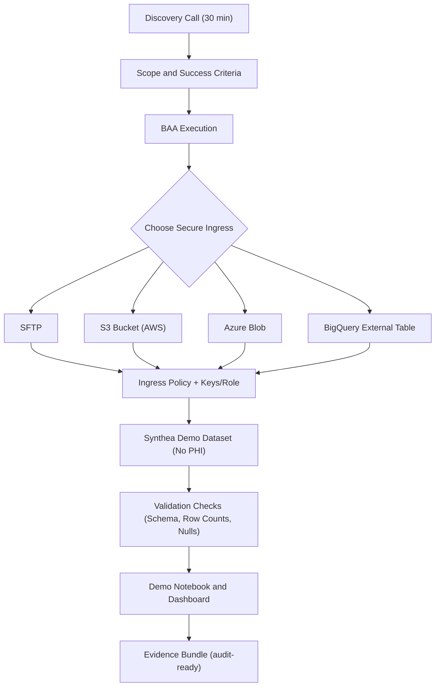
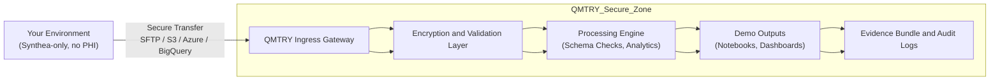
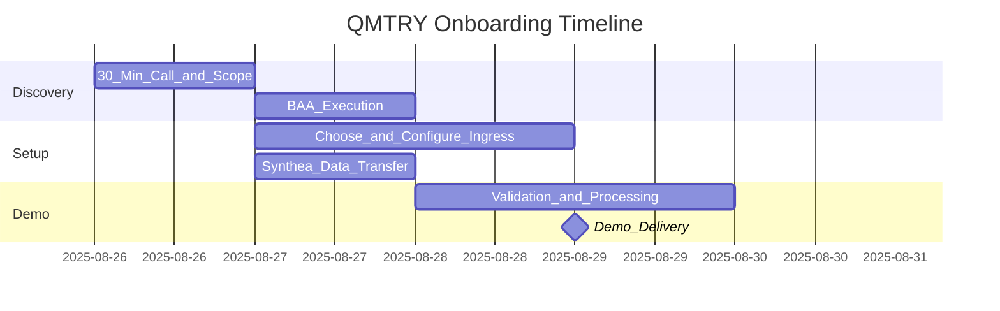
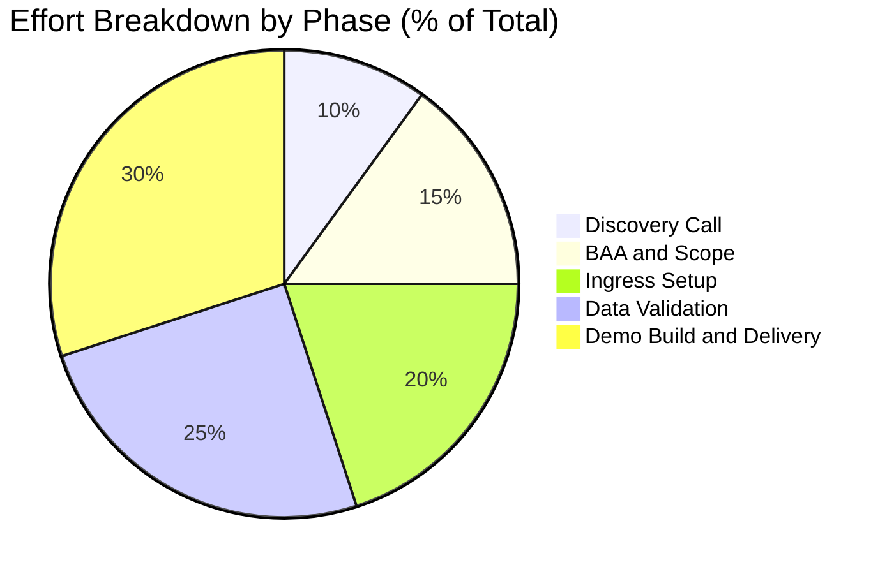

# QMTRY — Blast Off to Secure Healthcare Analytics Adventure! 🚀🔒

> **Epic 30-Minute Quest: Discover, Scope, and Seal the BAA Deal!** We'll geek out on secure data transfers (**SFTP / S3 / Azure Blob / BigQuery**) and rock demos with **Synthea** synthetic data — **zero PHI drama**! 🎉

[🌐 Dive into Our Onboarding Magic](https://qmtry.ai/compliance/) • Hit Us Up: contracts@qmtry.com 📧

---

## Why This Repo is Your New Best Friend! 😎

Healthcare heroes like you crave a **super-safe, lightning-fast** way to test-drive QMTRY without the hassle! This repo is your treasure map: We chat, high-five on a BAA, fire up **bulletproof data ingress**, test with **fun Synthea** fake data, and unleash an **audit-proof** demo — all while keeping real PHI locked away! No risks, just rewards! 💥

---

## Table of Contents (Your Adventure Roadmap)

- [Executive Summary](#executive-summary)  
- [Onboarding Flow (30-Min Thrill Ride → Demo Glory)](#onboarding-flow-30-min-thrill-ride-demo-glory)  
- [Security and Compliance Controls (Your Shield and Sword)](#security-and-compliance-controls-your-shield-and-sword)  
- [Architecture and Data Flow (The Epic Journey Visualized)](#architecture-and-data-flow-the-epic-journey-visualized)  
- [Timeline (Gantt: Your Time-Travel Chart)](#timeline-gantt-your-time-travel-chart)  
- [Effort Breakdown (Pie: Slice of the Action)](#effort-breakdown-pie-slice-of-the-action)  
- [What to Bring to the Call (Pack Your Gear!)](#what-to-bring-to-the-call-pack-your-gear)  
- [Secure Transfer Recipes (Cook Up Some Ingress Magic)](#secure-transfer-recipes-cook-up-some-ingress-magic)  
- [Evidence Bundle (Your Victory Loot)](#evidence-bundle-your-victory-loot)  
- [Appendix: Sample Data Contract (The Fine Print, But Fun)](#appendix-sample-data-contract-the-fine-print-but-fun)  
- [Repo Structure (Suggested Blueprint)](#repo-structure-suggested-blueprint)  
- [FAQ (Quick Answers to Burning Questions)](#faq-quick-answers-to-burning-questions)  
- [License (Free to Explore)](#license-free-to-explore)

---

## Executive Summary (The Big Bang Overview) 💥

- **Mission Objective:** In one turbo-charged session, sync on scope and security, slap that **BAA** signature, and pick your **secure ingress** superpower!  
- **Demo Safety Net:** We're all about **Synthea** synthetic data for every example — **PHI stays in your fortress** during evals! 🛡️  
- **Epic Win:** A repeatable, evidence-packed demo that'll have you ready to conquer production if the vibes are right! 🌟

---

## Onboarding Flow (30-Min Thrill Ride → Demo Glory)

Get ready for the smoothest onboarding ever! Here's the flow in all its glory:



---

## Security and Compliance Controls (Your Shield and Sword) 🛡️⚔️

- **BAA First, Fun Follows:** Signed before any secrets spill!  
- **PHI-Free Zone:** Synthea synthetic data only — real stuff? Not on our watch!  
- **Fort Knox Encryption:** TLS in flight, SSE-S3/KMS/Azure SSE at rest. Impenetrable!  
- **Minimal Access Magic:** Scoped IAM roles, time-limited creds — least privilege FTW!  
- **Data Diet and Delete:** Keep only what's needed, zap it when done.  
- **Audit Trail Awesomeness:** Logs for every ingress, check, and peek. Transparency level: MAX! 📜

---

## Architecture and Data Flow (The Epic Journey Visualized) 🌐

Behold the high-level blueprint of how your data dances securely into QMTRY's world! From your secure spot to our demo dazzle — all without a PHI hitch!



---

## Timeline (Gantt: Your Time-Travel Chart) ⏰

Strap in! Here's a snazzy Gantt showing how we zoom from kickoff to demo in days. Fasten your seatbelts — this is warp speed!



---

## Effort Breakdown (Pie: Slice of the Action) 🥧

Curious where the magic happens? Check this pie chart breaking down the effort — we're all about efficiency, baby! Minimal sweat for maximum impact! 💪



---

## What to Bring to the Call (Pack Your Gear!) 🎒

- **Your Quest Goal:** Stars, HEDIS, UM/RCM, population health — what's your win? 🏆  
- **Cloud Preference:** AWS, Azure, GCP? Pick your poison! ☁️  
- **Ingress Fav:** SFTP, S3, Blob, BigQuery — your call!  
- **Tech Buddy:** Someone for IAM/keys setup.  
- **Deadlines & Wins:** Reporting timelines and success metrics. Let's crush 'em! 📅

---

## Secure Transfer Recipes (Cook Up Some Ingress Magic) 🍳

Whip up secure transfers like a pro! All recipes use Synthea synthetic data for that zero-risk flavor. Choose your adventure:

1. **SFTP (Simple, Speedy, Secure!)** 🚀

```
# Upload (client-side) — Easy peasy!
sftp -i /path/to/key demo_ingress@ingress.qmtry.ai <<'EOF'
put ./synthea/*.csv /incoming/synthea/
bye
EOF
```

2. **AWS S3 (Your Bucket, Our Read-Only Peek!)** ☁️

```
# Example: create a bucket and upload (customer side)
aws s3 mb s3://qmtry-demo-synthea --region us-east-1
aws s3 sync ./synthea s3://qmtry-demo-synthea/synthea/
```

We'll swap IAM ARNs and tight policies during BAA time!

3. **Azure Blob Storage (Blob-tastic Uploads!)** 🟦

```
# Upload with az CLI — Smooth as butter!
az storage blob upload-batch \
  --account-name <yourAccount> \
  --destination 'qmtry-demo/synthea' \
  --source ./synthea
```

4. **BigQuery External Table (No-Copy Ninja Move!)** 📊

```
-- Customer creates an external table from GCS with synthetic CSVs
CREATE EXTERNAL TABLE `demo.synthea_patients`
WITH CONNECTION `us.gcs.my_conn`
OPTIONS (
  format = 'CSV',
  uris = ['gs://qmtry-demo/synthea/patients/*.csv'],
  skip_leading_rows = 1
);
```

---

## Evidence Bundle (Your Victory Loot) 🏆

- **Ingress Checklist:** Who, what, when, keys, and expiration — all documented!  
- **Validation Report:** Schema wins, row counts, null hunts, type triumphs.  
- **Run Log:** Timestamped play-by-play.  
- **Demo Workbook:** Queries + visuals that'll wow!  
- **Security Summary:** Controls, retention — auditor-approved.  

Export everything for your trophy case! 📁

---

## Appendix: Sample Data Contract (The Fine Print, But Fun) 📜

| Field       | Type   | Required | Notes                          |
|-------------|--------|----------|--------------------------------|
| patient_id | STRING | ✅       | Surrogate ID (synthetic)      |
| dob        | DATE   | ✅       | No real DOB in demos (Synthea)|
| gender     | STRING | ✅       | Coded per Synthea             |
| encounter_date | DATE | ✅   |                               |
| code_system| STRING | ✅       | e.g., ICD-10, RxNorm (synthetic)|
| code       | STRING | ✅       |                               |
| value      | STRING | ✅       | Observation or metric         |

**PHI Policy (Demo Mode):** Synthea only! No sneaky identifiers. 🕵️‍♂️

---

## Repo Structure (Suggested Blueprint) 🗺️

```
.
├─ README.md  (You're here! 📖)
├─ evidence-template/  (Your proof pack)
│  ├─ ingress-checklist.md
│  ├─ validation-report.md
│  └─ run-log.sample.json
├─ ingress-examples/  (Recipe folder)
│  ├─ sftp/
│  ├─ aws-s3/
│  ├─ azure-blob/
│  └─ bigquery/
└─ demo-notebooks/  (Fun with data!)
   └─ synthea-demo.md
```

---

## FAQ (Quick Answers to Burning Questions) ❓🔥

- **Real PHI in Pilot?** Nah, demo starts Synthea-style. PHI post-BAA and security thumbs-up!  
- **Demo Timeline?** Boom — 2–4 business days after BAA and setup. Lightning fast! ⚡  
- **What Do We Keep?** Bare minimum. Delete demo data on your say-so! 🗑️  

---

## License (Free to Explore) 📄

MIT for this doc repo. Your data? All yours, forever! 🌍
